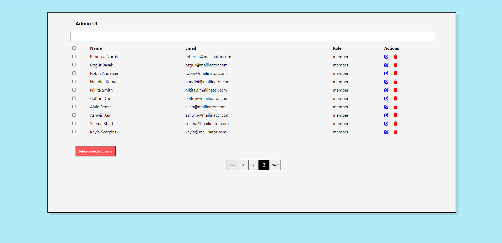
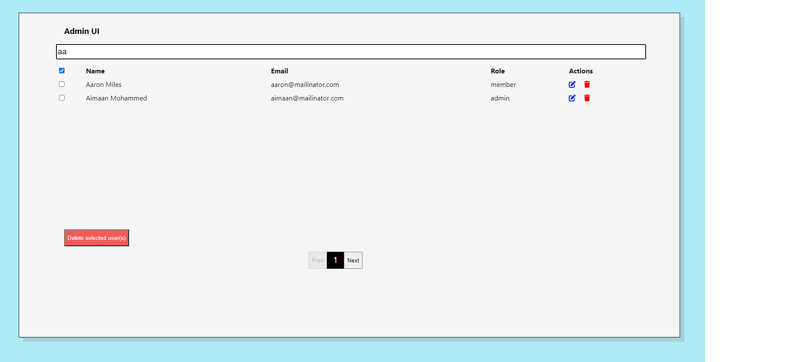
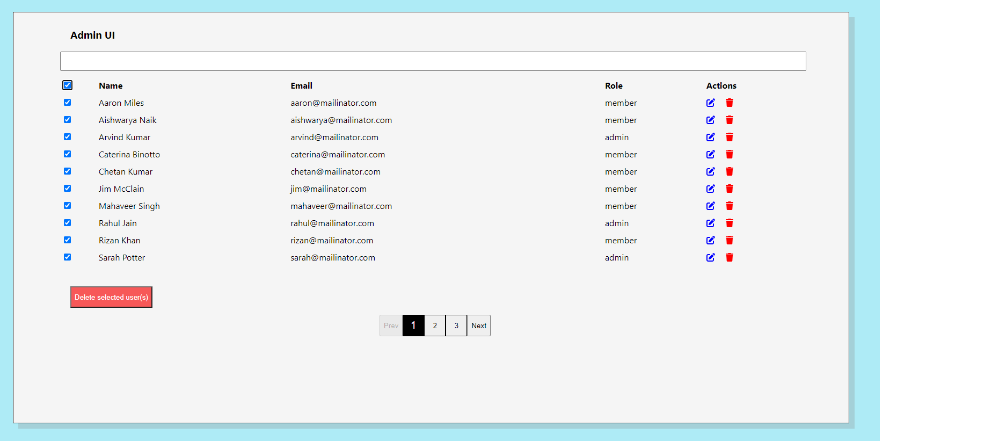
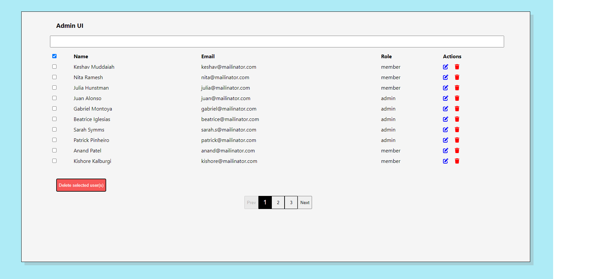

# Admin-UI

> This UI helps you manage users in the form of search, delete and edit

## Built with
1. ReactJS
2. HTML5 and CSS3

## Screenshots

## Main features

1. Search with users with their name, email, role
2. Delete one or many users (per page) by selcting individual or select all options.  

## Live version

Click <a href="https://hilarious-beijinho-0a188b.netlify.app/">here</a> to see the live version on Netlify.

## Getting started

This project was bootstrapped with <a href="https://github.com/facebook/create-react-app">Create React App</a>.

You need to have <a href="https://nodejs.org/en/">Node</a> installed on your computer.

To get a local copy of the repository, run below commands in sequence on your terminal

<pre>git clone https://github.com/rajkumardas2701/admin_ui.git</pre>
<pre>cd admin_ui</pre>
<pre>npm install</pre>
Switch to feature branch
<pre>npm start</pre>

`npm start` will open your default browser to load the app.

## Authors

👤 **Rajkumar Das**

- Github: [@rajkumardas2701](https://github.com/rajkumardas2701)
- Twitter: [@Rajkuma58621299](https://twitter.com/Rajkuma58621299)
- Linkedin: [Rajkumar Das](https://www.linkedin.com/in/rajkumar-das-41308961/)

## 🤝 Contributing

Contributions, issues and feature requests are welcome!

Feel free to check the [issues page](https://github.com/rajkumardas2701/admin_ui/issues).

## Show your support

Give a ⭐️ if you like this project!

## 📝 License

This project is [MIT](lic.url) licensed.